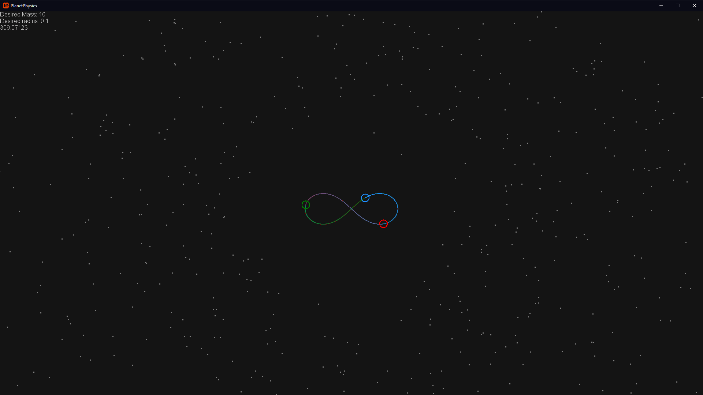
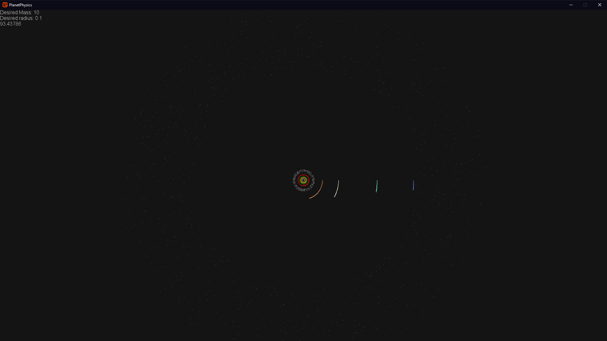

# PlanetPhysics
A small planet simulator built for fun as a side project.

Created using Monogame and Monogame Extended

Currently uses the rather inaccurate Euler method for integration (this is mostly mitigated by using very small step sizes), but ideally it should use something like the Runge-kutta methods for better accuracy.  
Includes several pre-set situations, including a fictional but nice-looking system (shown below), a stable 3-body figure-8 system, a binary star system, and our solar system to scale (with and without moons)
